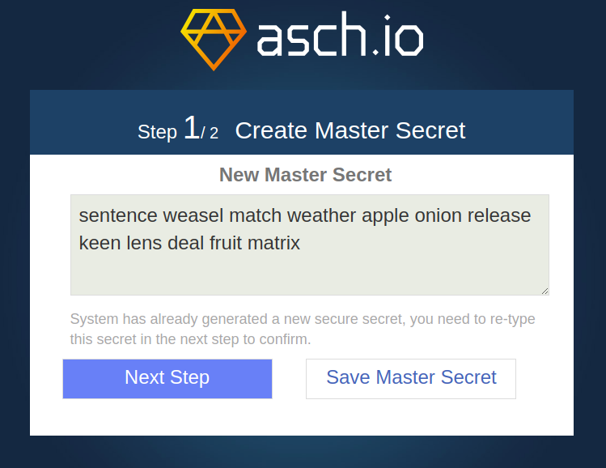
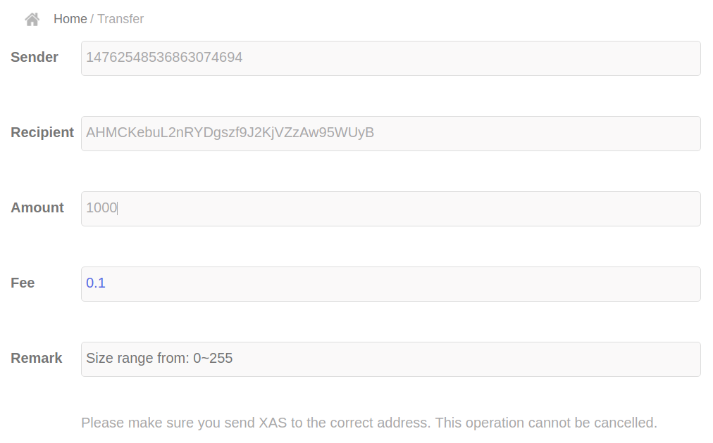

# Create a new Asset by using the (default) front-end

The normal process would be:

- Register publisher
- Wait 10 sec for next block
- Register asset
- Wait 10 sec for next block
- Mint tokens (only available in Chinese language, you can see it on the screen, but not translated yet)

Thanks to @a1300 for the above

## create a new user

Make sure that ASCH is running (`cd asch && node app.js`) now point your browser to http://localhost:4096/#/login and press the "New account" button.



In this example the secret will become `pair join budget leisure rough blouse task receive curve auction habit reform` (write it down somewhere). Now press the "Next Step" button and confirm the secret.

You will find your new accout with an empty balance:


Find your address under the "My Account" tab on the left side of your screen:


As you see our new XAS address is `A7BAoWK4UA2KuQSugUCKyhFHiHzgXyYTD9`.

### Give the new user some XAS
Use the genesis account to send the new user some XAS. The genesis account, see also [Dapp Development Tutorial 1: Asch Dapp Hello World](https://github.com/AschPlatform/asch-docs/blob/master/dapp/hello_world/en.md);

**Genesis Account**
```
    address: 14762548536863074694
    secret: someone manual strong movie roof episode eight spatial brown soldier soup motor
    publicKey: 8065a105c785a08757727fded3a06f8f312e73ad40f1f3502e0232ea42e67efd
```

Point your browser to http://localhost:4096/#/login again. Login with the genesis account now. Then Click the "Transfer" tab on the left side of your screen. Now send 1000 XAS to `A7BAoWK4UA2KuQSugUCKyhFHiHzgXyYTD9`.



## Create a publisher
Login with your new account now. You'll see that the balance contains 1000 XAS now. Chose the "Asset" tab from the left side of the screen now. Then navigate to "Registered Publisher" tab and fill in the form like that shown in the figure below:


Confirm the popup that: "This operation requires a fee of 100 XAS"

Now wait at least 10 seconds for the next block.

## Create an asset
Now navigate to the "Registered Assets" tab an fill in the form like that shown in the figure below, ignore the field under "Accuracy":

Confirm the popup that: "This operation requires a fee of 500 XAS". After 10 second you will find your asset under the "My Issued Assets":

.

Now you can cancel, change, release and transfer your new assets. Let's try to release some pub.New assets now.

Enter the number of asset you're issuing in the popup and confirm your operation:

.

After 10 seconds you'll find your 200000 new `pub.NEW` assets under the "Asset Profile". Now you're able to send (transfer) `pub.NEW` assets to other adresses too. 

# Using asch-redeploy
Notice that you can also use [asch-redeploy](https://github.com/AschPlatform/asch-redeploy) to create a new Asset:

Change the directory to some random Dapp and execute:

```
> asch-redeploy --publisher pub --asset NEW
```


