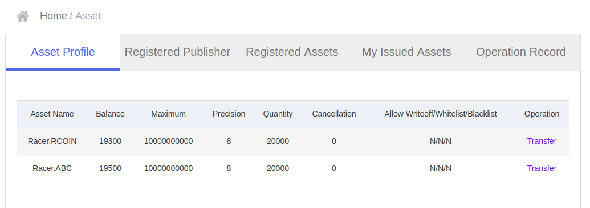
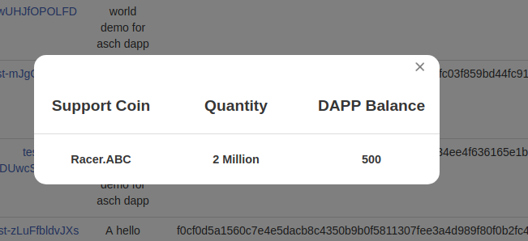
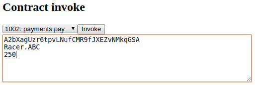

# How to use ASSETS on the sidechain

>I wonder; i've created a new asset (Racer.RCOIN) with account (secret: sentence weasel match weather apple onion release keen lens deal fruit matrix), now install a new Dapp with the same account.
>Then i create a new account(, and send some XAS to it using the genenis account), which deposit some XAS to the Dapp Sidechain.
>After that the Dapp sends Racer.RCOIN to the new account by calling `app.balances.increase()`.
>All works well, the new account gets it's Racer.RCOIN on it's balance, but my question is where do these Racer.RCOIN come from? I expect that the Racer.RCOIN decrease on the balance of the Dapp owner, when i send some Racer.RCOIN via the Dapp. It seems only the balance of the new account increases?

# Let's build an example Dapp
Notice you can also download the example code at [https://github.com/bassjobsen/asch-test-assets/](https://github.com/bassjobsen/asch-test-assets/)

## Setup your code

```
> git clone https://github.com/bassjobsen/asch-test-dapp.git asch-test-assets
```

### Create a smart contract
To send assests on the sidechain we'll need a smart contract. Create a new file `asch-test-assets/contract/payment.js` and write down the follwing code into it:

```
module.exports = {
  pay: async function(address, currency, amount) {
	app.balances.increase(address, currency, amount * 100000000);
  }	
}
```

Notice that we multiply the `amount` with `100000000`, because of we'll create an asset having a `presision` of `8`.

### Make the new contract avaible

Now edit the `asch-test-assets/init.js` file and add the following line of code:
```
  app.registerContract(1002, 'payments.pay')

```

## Deploy our Dapp and create a new asset
To make it easy we'll use [asch-redeploy](https://github.com/AschPlatform/asch-redeploy) to deploy out Dapp. Asch-redeploy uses the following account by default:

```
# master account
{
  "secret": "sentence weasel match weather apple onion release keen lens deal fruit matrix",
  "publicKey": "a7cfd49d25ce247568d39b17fca221d9b2ff8402a9f6eb6346d2291a5c81374c",
  "address": "AHMCKebuL2nRYDgszf9J2KjVZzAw95WUyB",
}
```

I've already registered a publisher called `Racer` with the same account, so i will have to user the same publisher name again to register a new asset. Create the new asset as follows:

```
> cd asch-test-assets
> asch-redeploy --publisher Racer --asset ABC 
```

The above should give you the following ouput:

```
[2018-07-30 11:42:154][INFO] check balance...
[2018-07-30 11:42:814][INFO] asset "ABC" registered
[2018-07-30 11:42:817][INFO] waiting 11 sec for asset registration transaction to be written in block...
[2018-07-30 11:43:157][INFO] 20000 ABC tokens successfully created
[2018-07-30 11:43:159][INFO] waiting 11 sec for the create token transaction to be persisted to the next block...
[2018-07-30 11:43:172][INFO] starting to register Dapp...
....
[2018-07-30 11:43:268][INFO] DAPP registered, DappId: ee0c22de321610bbc5698243d66f5122a20d2b1b1d534ee4f636165e1b6cd6f6
[2018-07-30 11:43:431][INFO] dappId "ee0c22de321610bbc5698243d66f5122a20d2b1b1d534ee4f636165e1b6cd6f6" successfully added to "../asch/config.json"
....
[2018-07-30 11:43:457][INFO] starting asch-node in "/home/bass/testomgeving/asch" on port 4096
[2018-07-30 11:43:433][INFO] DAPP refuel with 500 Racer.ABC, transactionId: "bf4ae04a1fa6416ee64f012baea0909bf6958c4e36c778f6e12d3295b4d024f8"
[2018-07-30 11:44:550][INFO] waiting for file changes...
```

Now point your browser to http://localhost:4096/ and login with the default master account used to register the Dapp in the above. Under assets you will find that the new Racer.ABC asset is there:



As you can see the balance contains `19500 Racer.ABC`s now. `20000` created minus the `500` send to the Dapp's sidechain. So the Dapp balance contains 500 Racer.ABC as can be seen in the picture beneath:



### Create a new user you can receive the Racer.ABC asset
We use asch-cli to create this account and fill its Dapp balance with XAS. Notice that the new user requires XAS to pay the contract too.

#### Create a new user
```
> asch-cli -H 127.0.0.1 -P 4096 crypto --generate
? Enter number of accounts to generate 1
[ { address: 'A2bXagUzr6tpvLNufCMR9fJXEZvNMkqGSA',
    secret: 'chicken antenna coral survey aunt engine resist retire empty pelican fox pupil',
    publicKey: 'e7ee6a5f41a021f48d6c04db89842506176d902f0aeaab6110eac5af9da97028' } ]
Done
```
Remember your secret key.


#### Give the new user some money (XAS)

The user needs XAS to pay the racing fees

```
> asch-cli -H 127.0.0.1 -P 4096 sendmoney --secret "someone manual strong movie roof episode eight spatial brown soldier soup motor" --to "A2bXagUzr6tpvLNufCMR9fJXEZvNMkqGSA" --amount 100000000000
```
The above sends 10 XAS with the genesis account to our new `A2bXagUzr6tpvLNufCMR9fJXEZvNMkqGSA` address:

```
# genesis account
{
  "secret": "someone manual strong movie roof episode eight spatial brown soldier soup motor",
  "publicKey": "8065a105c785a08757727fded3a06f8f312e73ad40f1f3502e0232ea42e67efd",
  "address": "14762548536863074694"
}
```

#### Deposit some XAS to the Dapp sidechain

Each new user should deposit some of their XAS to the Dapp's Side chain. 

```
asch-cli -H 127.0.0.1 -P 4096 deposit --secret "chicken antenna coral survey aunt engine resist retire empty pelican fox pupil" --dapp ee0c22de321610bbc5698243d66f5122a20d2b1b1d534ee4f636165e1b6cd6f6 --currency XAS --amount 5000000000
```
## Now test the pay contact

Point your browser to the new Dapp at: `http://localhost:4096/dapps/ee0c22de321610bbc5698243d66f5122a20d2b1b1d534ee4f636165e1b6cd6f6/` and log in with the `chicken antenna coral survey aunt engine resist retire empty pelican fox pupil` secrect of the account we've created just before.

Now we can invoke the contract. Let's try to send 250 Racer.ABC as shown below:



The above works very well and our balance contains 250 Racer.ABC now:

```
{balances: Array(2)0: {currency: "XAS", balance: "4990000000"}1: {currency: "Racer.ABC", balance: "25000000000"}length: 2__proto__: Array(0)success: true__proto__: Object
(index):84 {balances: Array(2), success: true}
```

### Something wrong?
Let's repeat the above step two times more; something strange happens. Our balance contains 750 Racer.ABC. We refuel our Dapp with 500 Racer.ABC only??? Where did the other 250 Racer.ABC come from?

```
{balances: Array(2), success: true}balances: Array(2)0: {currency: "XAS", balance: "4970000000"}1: {currency: "Racer.ABC", balance: "75000000000"}length: 2 __proto__: Array(0)success: true__proto__: Object
```
#### The same for other assets
Notice that we can also use the contract to send Racer.RCOIN, XAS or even BTC. Also sending RRR (which not exists) can be send

```
balances: Array(5), success: true}balances: Array(5)0: {currency: "XAS", balance: "29930000000"}1: {currency: "Racer.ABC", balance: "75000000000"}2: {currency: "Racer.RCOIN", balance: "25000000000"}3: {currency: "BTC", balance: "25000000000"}4: {currency: "RRR", balance: "25000000000"}length: 5__proto__: Array(0)success: true__proto__: Object
```

##### What's wrong with the contract
We've found two issues with our contract als described above. The first issue is that can send any assest and any amount to our address by invoking the contract. The second issue will be that we only have to use our own secrect to send assests to our address.


